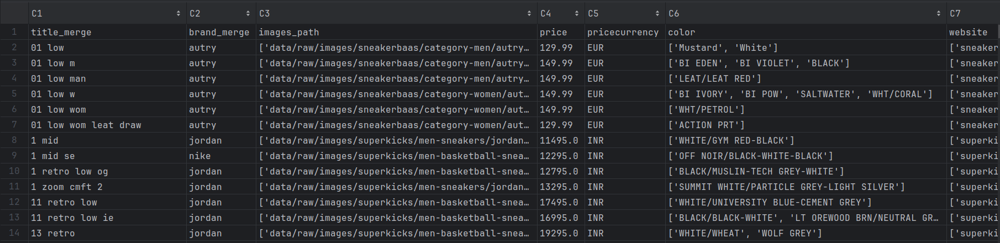
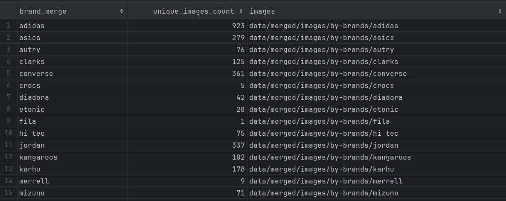
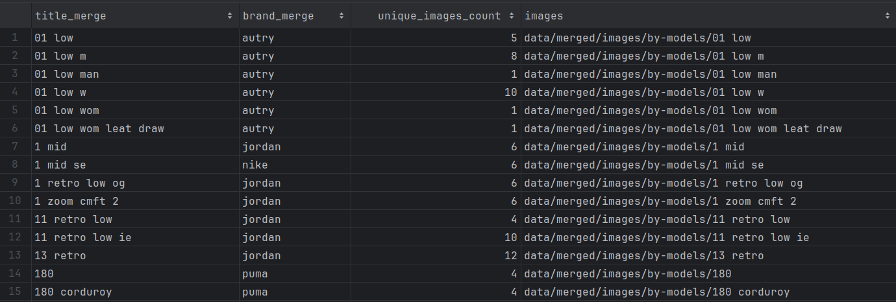
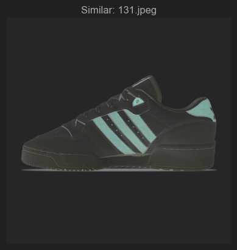
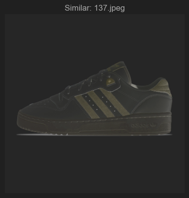

# Data preprocessing, merging and eda

## Данные и предобработка

- Всё происходит в файле [merger.py](src/data/merger.py)
- Для каждого датасета дропаем ненужные и лишние колонки
- Приводит все колонки к нижнему регистру
- Дропаем дубликаты в каждом датасете
- Добавляем в каждый датасет колонку с названием сайта

> Всего спарсили 5 сайтов, но пока решили смерджить только 2 из-за сложности с очисткой данных. 
> Используем `superkicks` и `sneakerbaas`.

### price and pricecurrency

- Если есть колонка `price` и `pricecurreny` - очищаем и приводим `price` к float.

### title and brand

- В датасетах название `title` кроссовок идёт в формате: `{бренд} {модель} "{цвет}"`,
поэтому можно разделить модель и цвет по кавычкам.
- Чтобы хорошо смерджилоcь, нужно также убрать бренд из начала `title`, так как в некоторых датасетах бренда в начале нет.
- Для этого берём все колонки `brand` из всех датасетов, создаем список всех брендов, а также их комбинаций по 2.
Комбинации по два нужны, чтобы получить все возможные коллабы. Какие-то бренды прописываем вручную.
- Далее создали файлик `color_words.txt` (data/merged/other/color_words.txt) и поместили туда основные слова-цвета на английском.
- Наконец можно очистить колонку `title` - сначала удаляются лишние символы, греческие буквы и тд., всё приводится к нижнему регистру.
- Далее слева удаляем бренд (детектим по брендам и коллабам, которые собрали), справа удаляем color.
- Цвета из кавычек `"` переносятся в отдельную колонку `color`. Если кавычек нет, то пытаемся просто удалить справа слова из `color_words.txt`
- Колонку `brand` просто чистим от лишних символов

## Merge

- Мерджить будем по очищенной колонке `title`.
- Делаем `groupby` по этой `title` и получаем `main_dataset` (data/merged/metadata/main_dataset.csv)`, в котором оставили основные колонки.
- Во время `groupby` делаем небольшую обработку брендов, **например, бренды `adidas` и `adidas originals` объединяем в один бренд `adidas`.**
- Получили основной датасет (`main_dataset.csv`). Описание колонок
  - **title_merge** - название модели
  - **brand_merge** - название бренда
  - **images_path** - список путей до спаршенных картинок
  - **price** - цена
  - **pricecurrency** - валюта
  - **color** - список цветов
  - **website** - список названий сайтов

> По итогу 2067 моделей кроссовок смерджились в 877

## Images merge

- Нужно теперь смерджить картинки (раскидать по соответствующим папкам), чтобы было удобно использовать в моделях.
- Мерджить будем два раза: по названию бренда и названию модели.

### Brand merge

- Используем полученный `main_dataset.csv`
- Сделаем `groupby` по брендам и начинаем мердж картинок из `images_path`.
  - Картинки одного бренда копируются в одну папку, идентичные файлы удаляются
  - Картинки с расширением `.gif` удаляются
  - Картинки с остальными расширениями переводятся в палитру `RGB`. (Из-за того что некоторые картинки имеют отдельный канал прозрачности `RGBA`)
  - Картинки переводятся к одному формату `.jpeg`
- Итоговый датасет по брендам `data/merged/metadata/brands_dataset.csv`. Описание колонок:
  - **brand_merge** - название бренда
  - **unique_images_count** - количество картинок для бренда
  - **images** - путь к папке со смердженными картинками 

> Всего 30 брендов
> 
> Наблюдается большой дисбаланс по количеству картинок в разных брендах

### Model merge

- Используем полученный `main_dataset.csv`
- Начинаем мердж картинок из `images_path`.
  - Картинки одной модели копируются в одну папку, идентичные файлы удаляются
  - Картинки с расширением `.gif` удаляются
  - Картинки с остальными расширениями переводятся в палитру `RGB`. (Из-за того что некоторые картинки имеют отдельный канал прозрачности `RGBA`)
  - Картинки переводятся к одному формату `.jpeg`
- Итоговый датасет по моделям `data/merged/metadata/models_dataset.csv`. Описание колонок:
  - **title_merge** - название модели
  - **brand_merge** - название бренда
  - **unique_images_count** - количество картинок для модели
  - **images** - путь к папке со смердженными картинками

## EDA

- Сделали небольшое EDA [`basic-eda.ipynb`](notebooks/eda/basic-eda.ipynb)
  - Тут вывели как выглядят метаданные
  - Посмотрели сколько картинок всего и какие бренды имеют больше всего картинок
  - Посмотрели, что все картинки в одном формате и в одной `RGB` палитре, значит имеют по 3 канала. (значит всё правильно преобразовали)
  - Посмотрели размеры картинок - они различные, от 400х400 до 2000х2000.
- Пока работаем с датасетом с брендами. Взяли эмбеддинги [`resnet-embedding-eda.ipynb`](resnet-embedding-eda.ipynb) 
всех картинок c помощью [`resnet152`](src/data/features/resnet152.py) и использовали SVD, PCA, TSNE. Посмотрели как картинки лежат в пространстве.
- Также попробовали считать косинусное расстояние между картинками, чтобы найти дубликаты. Сработало не очень. Даже при большом
пороге картинки отличаются. Например, порог 0.99:

